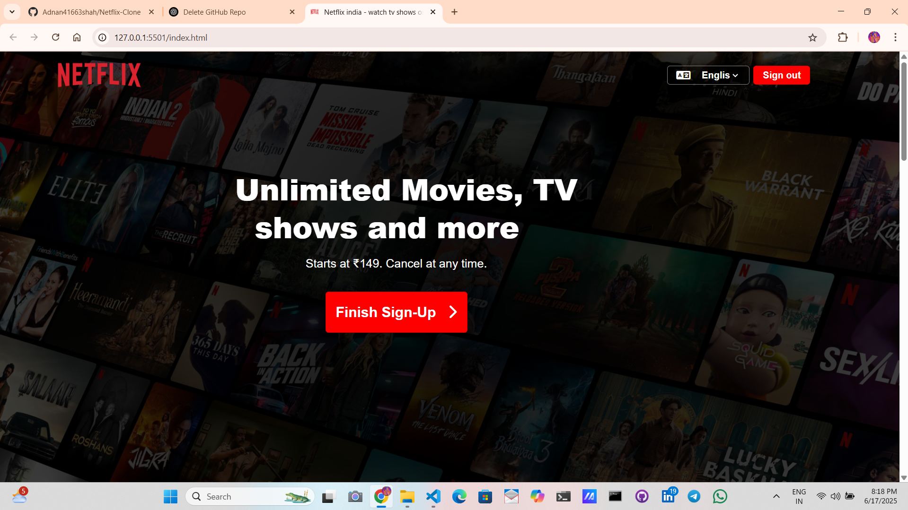
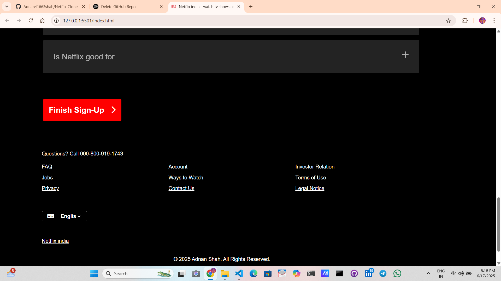

# 🎬 Netflix Clone - Static Website

Welcome to my **Netflix Clone** — a front-end replica of the Netflix homepage built with **pure HTML and CSS**! This responsive and visually appealing project mimics the Netflix user interface, including features like a hero section, navbar, movie showcase, FAQs, and a footer, all wrapped in a clean layout.

## 🌐 Live Preview

🔗 [View Live Demo](#) *(Replace with GitHub Pages link if deployed)*

---

## 📸 Screenshots

| Hero Section | Movie Gallery |
|--------------|----------------|
|  |  |

## 🚀 Features

- 🎥 **Netflix-style UI** with a black theme and bold typography.
- 📱 **Responsive Design** using media queries.
- 🎞️ **Movie Thumbnails** with hover effects.
- 🧭 **Navigation Bar** with buttons and language selector.
- 📚 **FAQ Section** styled with collapsible-like cards.
- 📦 **No frameworks** — only clean and well-structured HTML & CSS.

---

## 🛠️ Tech Stack

| HTML5      | Markup structure     
| CSS3       | Styling and layout  

📧 Contact

👤 Adnan Shah

📨 Email Me: adnanshah41663@gmail.com

🌐 GitHub Profile: https://github.com/Adnan41663shah

📄 License
This project is free to use for learning and educational purposes. Not intended for commercial use or distribution.

⭐️ If you like this project, don’t forget to star the repository!

